# Youtube Data Pipeline using Airflow▶️

We will extract data from youtube using the youtube API. Then we will use Python to extract and transform it. We will then deploy airflow on EC2 instance and then we will store our data at 2 locations - One is the AWS S3 and MongoDB. We will store the data based on the keyword for which we are extracting the data from youtube and then separate files will get created for each keyword in S3 and separate collections for each keyword will get created in MongoDB.

## 💻 Tech Stack

- 🐍 Python
- 🛫 Airflow
- ☁️ AWS S3
- 🍃 MongoDB
- 📺 YouTube API
- 🖥️ AWS EC2

## 📦 Prerequisites

- You need to have a google account to create the youtube API key.
- You need to have an AWS account to create the S3 bucket and EC2 instance.
- You need to have a MongoDB account to create the MongoDB cluster.
- You need to have a basic understanding of Python and Airflow.

## Step 1: Create Youtube API and MongoDB credentials

### Create Youtube API Key

For this you need to have a google account. Then go to API and Services. Once you reach there click on <b>Create Credentials</b>.

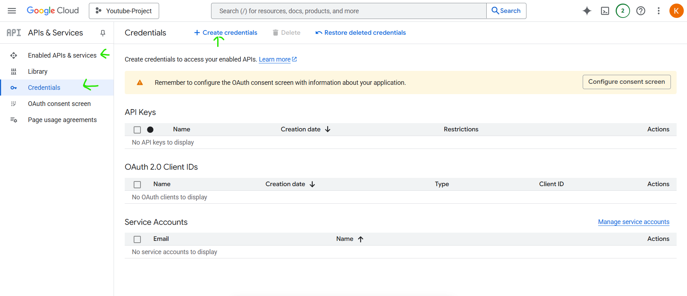

And then select the <b>API key</b> option:
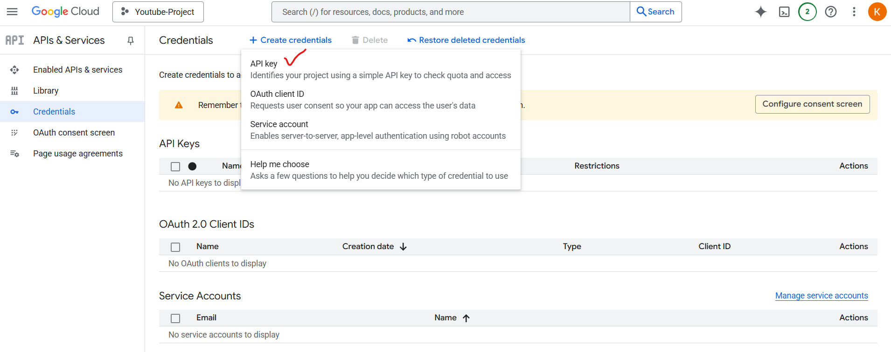

This will generate an API key which you need to store.

### Set Up a MongoDB Cluster

You also need to setup a MongoDB cluster where you can store the extracted youtube data of your project. Once the cluster is ready, we need to obtain the connection string for MongoDB atlas where you need to add the username,password and database name. For that first click on <b>Connect</b> button on the cluster page:
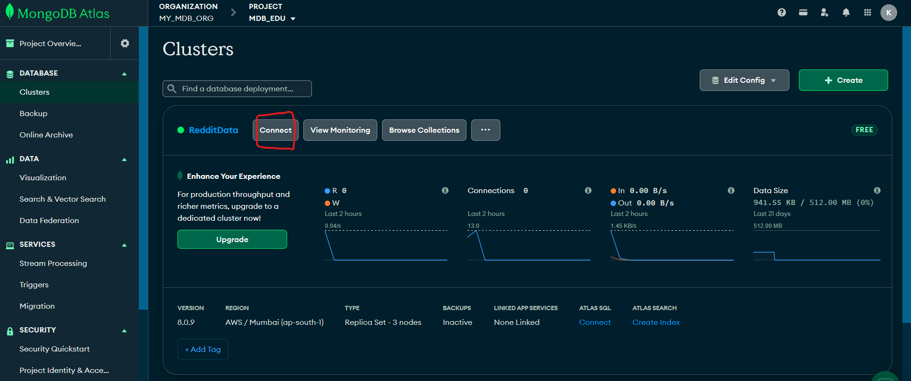

Then select <b>Compass</b>.
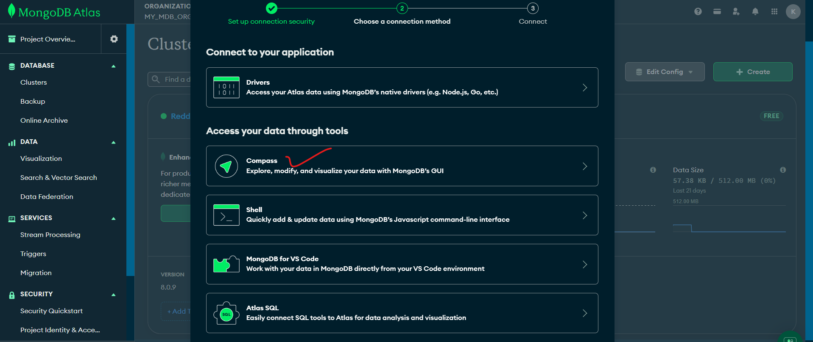
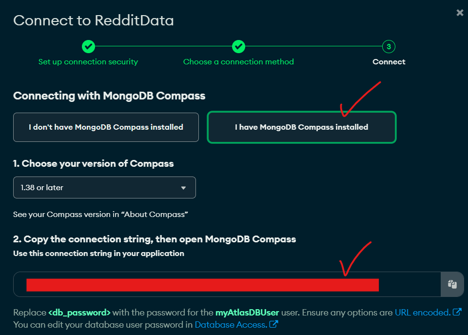
Then you will find a connections string. You need to replace the username and password with the username and password you created while creating the cluster. Also replace the database name with the name of your database. The connection string will look something like this:

```bash
mongodb+srv://<username>:<password>@<dbname>.abcde.mongodb.net/
```

### Create a .env file

We need to create a .env file where we will store the credentials for the youtube API and MongoDB cluster. The <b>.env</b> file will look something like this:

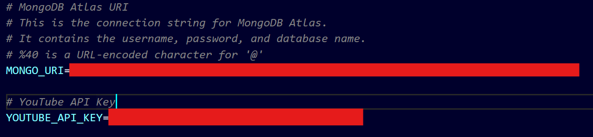

### Create a AWS S3 bucket

We also need to create a S3 bucket where we will store the extracted data. For that go to AWS S3 and create a bucket.
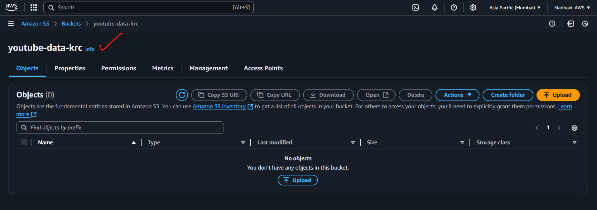

## Step 2: Create a EC2 instance

Before we start creating the EC2 instance we need to create an IAM role where we will assign 2 policies - <b>AmazonS3FullAccess</b> and <b>AmazonEC2FullAccess</b>. This will allow the EC2 instance to access the S3 bucket and also allow us to create and manage EC2 instances. For that go to IAM and create a role and attach policies to it:
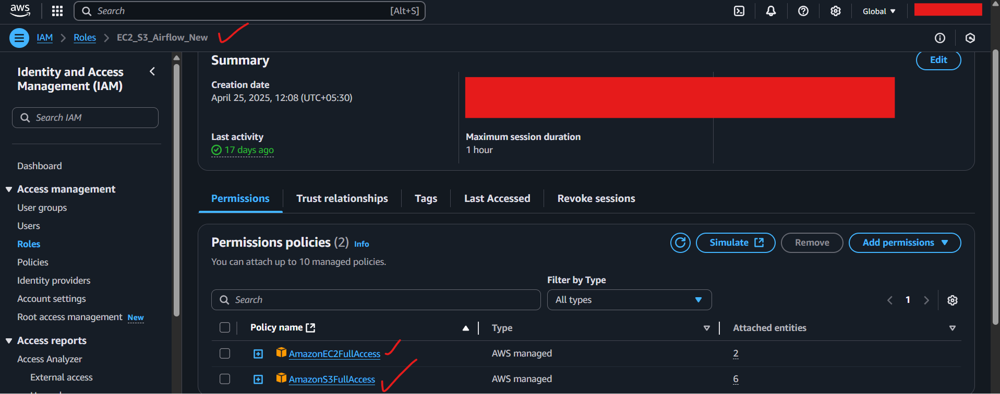

We need to create a EC2 instance where we will deploy the airflow. For that go to AWS EC2 and create a instance. Select the <b>Ubuntu Server 20.04 LTS</b> as the AMI.

- Select the instance type as <b>t3.medium</b> and then create a key value pair(.pem extension) and assign it as follows:
  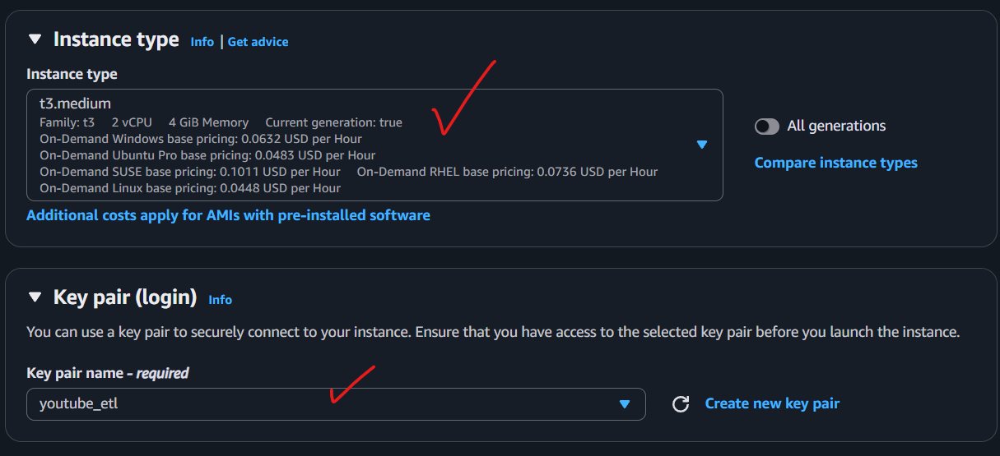
- Then go to <b>Network Settings</b> and select the security group as <b>SSH</b> and <b>HTTP</b>:
  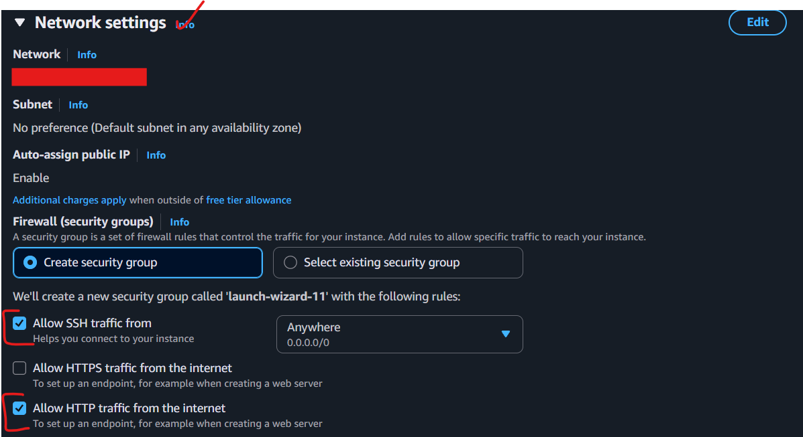
- Then go to <b>Configure Storage</b> and select the storage as <b>16 GB</b>:
  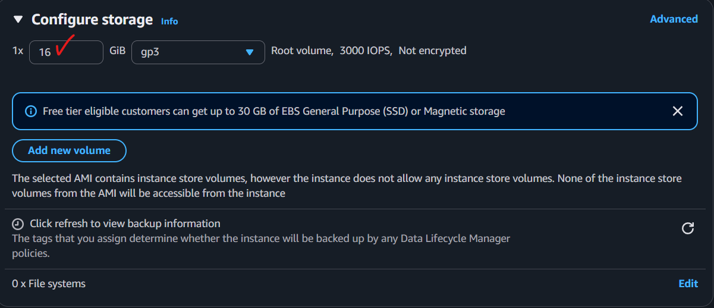
- Then go to <b>Advanced Details</b> and select the IAM role we created earlier:
  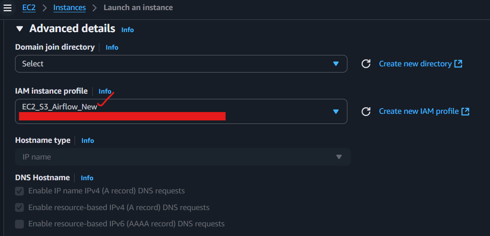
- Then once the instance is created, go to the instance and select the <b>Security Group</b> and then select the <b>Inbound rules</b> and add a rule for <b>HTTP</b>, <b>SSH</b> and <b>Custom TCP</b> and select the port as <b>8080</b>:
  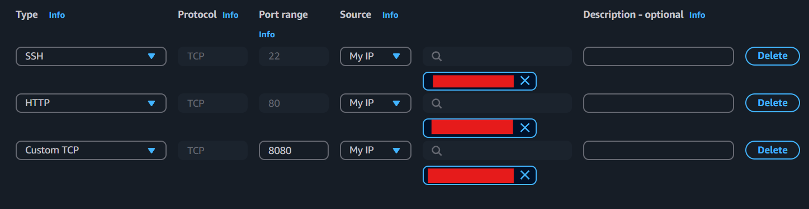

## Step 3: Airflow Installation

Once the instance is created we need to do SSH into our instance for which you have to copy the command present here:
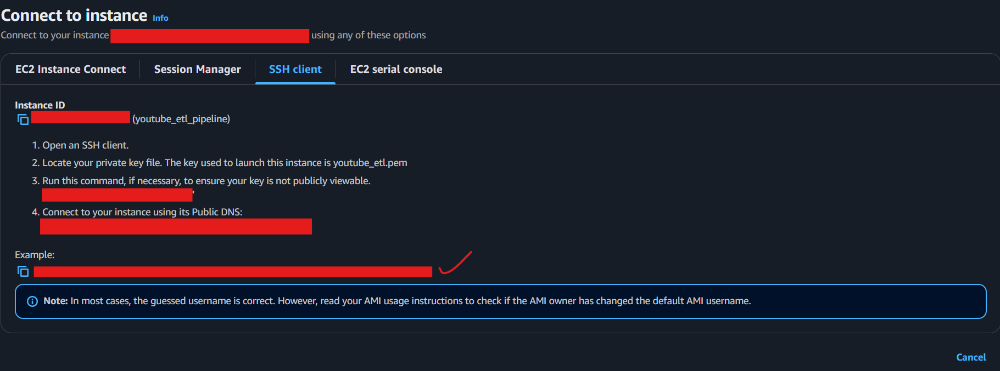

Now once you are in the instance, we need to install the following packages:

```bash
sudo apt update && sudo apt install -y python3-pip python3-venv
```

Then we need to create a virtual environment and activate it. We need to create a virtual environment because airflow is not compatible with python 3.10 and above. So we need to create a virtual environment with python 3.8. For that run the following commands:

```bash
python3 -m venv airflow_env
source airflow_env/bin/activate
pip install apache-airflow
```

Then to start the airflow for that we need to run the following command:

```bash
airflow standalone
```

Note down the username and password which you will find somewhere down as follows:
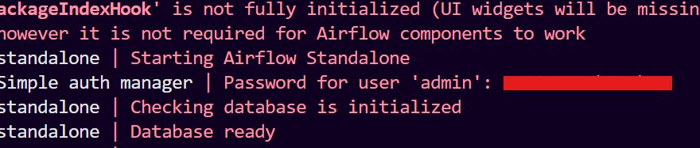
Then go to the browser and type the public IP of your instance and port as 8080. The URL will look something like this:

```bash
http://<public_ip>:8080
```

Then you will be prompted to enter the username and password. Enter the username and password you noted down earlier. You will find the Airflow UI.

Now open a new terminal and SSH into the instance again. Now we have to create a dags folder in the airflow directory where we will store our necessary files. For that navigate to the airflow directory and create a folder named <b>dags</b>:

```bash
mkdir dags
```

Then create a new powershell terminal and then run the following command to copy the files from your local machine to the instance. Make sure you are in the directory where you have stored the <b>.pem</b> file and also make sure you are in the directory where you have stored the <b>youtube_etl.py</b> and <b>youtube_dag.py</b> files:

```bash
scp -i "C:\Users\91996\Dropbox\PC\Documents\Data Engineering\Data-Engineering-Project-ETL-Pipeline\Youtube_ETL_Pipeline\youtube_etl.pem" "C:\Users\91996\Dropbox\PC\Documents\Data Engineering\Data-Engineering-Project-ETL-Pipeline\Youtube_ETL_Pipeline\requirements.txt" ubuntu@ec2-13-127-36-72.ap-south-1.compute.amazonaws.com:/home/ubuntu/airflow/dags/

scp -i "C:\Users\91996\Dropbox\PC\Documents\Data Engineering\Data-Engineering-Project-ETL-Pipeline\Youtube_ETL_Pipeline\youtube_etl.pem" "C:\Users\91996\Dropbox\PC\Documents\Data Engineering\Data-Engineering-Project-ETL-Pipeline\Youtube_ETL_Pipeline\youtube_etl.py" ubuntu@ec2-13-127-36-72.ap-south-1.compute.amazonaws.com:/home/ubuntu/airflow/dags/

scp -i "C:\Users\91996\Dropbox\PC\Documents\Data Engineering\Data-Engineering-Project-ETL-Pipeline\Youtube_ETL_Pipeline\youtube_etl.pem" "C:\Users\91996\Dropbox\PC\Documents\Data Engineering\Data-Engineering-Project-ETL-Pipeline\Youtube_ETL_Pipeline\youtube_dag.py" ubuntu@ec2-13-127-36-72.ap-south-1.compute.amazonaws.com:/home/ubuntu/airflow/dags/

scp -i "C:\Users\91996\Dropbox\PC\Documents\Data Engineering\Data-Engineering-Project-ETL-Pipeline\Youtube_ETL_Pipeline\youtube_etl.pem" "C:\Users\91996\Dropbox\PC\Documents\Data Engineering\Data-Engineering-Project-ETL-Pipeline\Youtube_ETL_Pipeline\.env" ubuntu@ec2-13-127-36-72.ap-south-1.compute.amazonaws.com:/home/ubuntu/airflow/dags/
```

first activate the virtual airflow environment and then go to the instance and navigate to the <b>dags</b> folder and then run the following command to install the requirements:

```bash
source airflow_env/bin/activate
pip install -r requirements.txt
```

## Step 4: Create a DAG

Then run the following command to start the airflow:

```
airflow standalone
```

Now as earlier if you navigate to the Airflow UI, you will find your newly created DAG as follows:
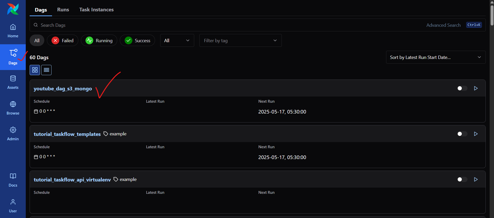
Then click on the DAG and then you will reach the DAG page. Here you will find all your tasks. You can click on the <b>Trigger DAG</b> button to run the DAG. Once the DAG is triggered, you will find the status of the tasks as follows:
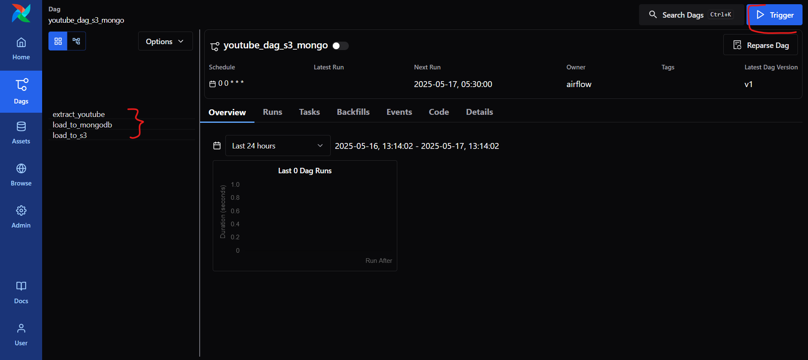

### 🚨 Important: First enable the Youtube Data API otherwise it wont be able to fetch data. Only after that trigger the DAG. 🚨

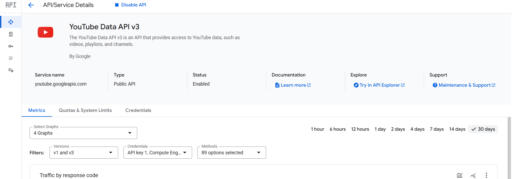

Once the DAG is triggered, you will find the status of the tasks as follows:
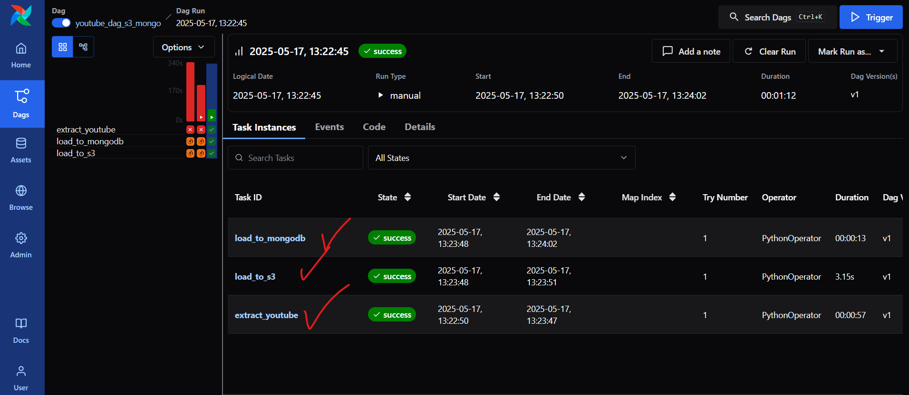
Then click on the <b>Task</b> and then you can find the logs of the task.

## Step 5: Check the S3 bucket and MongoDB

Once the DAG is triggered, you will find the data in the S3 bucket as follows:
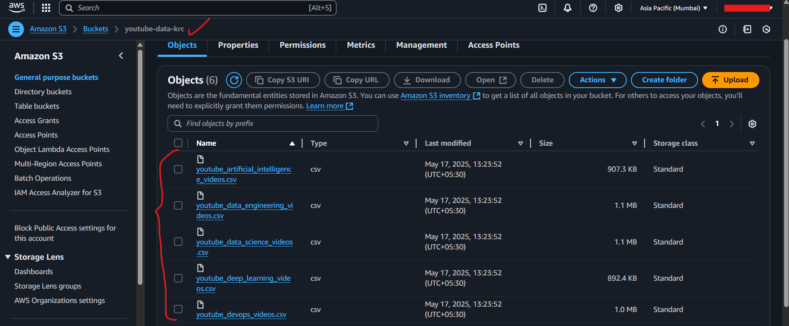
Then you can also find the data in the MongoDB as follows:
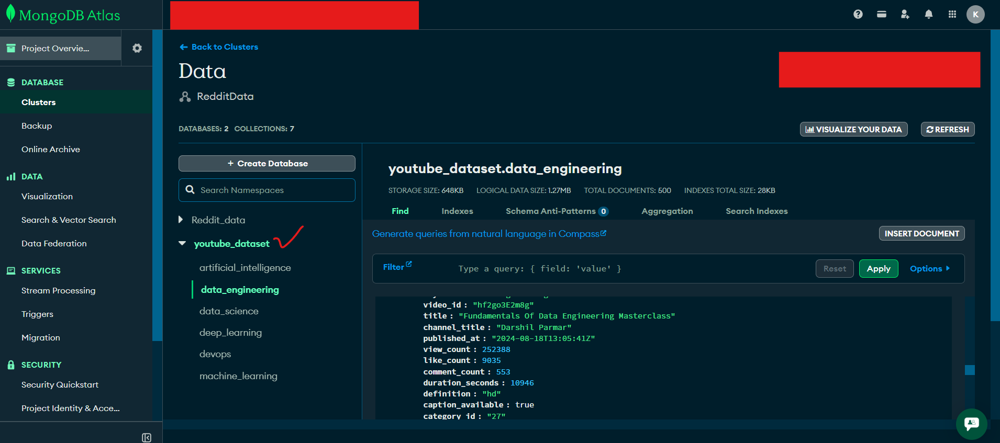

## Step 6: Conclusion

In this project we have created a data pipeline using Airflow where we have extracted data from Youtube using the Youtube API and then stored the data in S3 and MongoDB. We have also created a DAG to automate the process.
